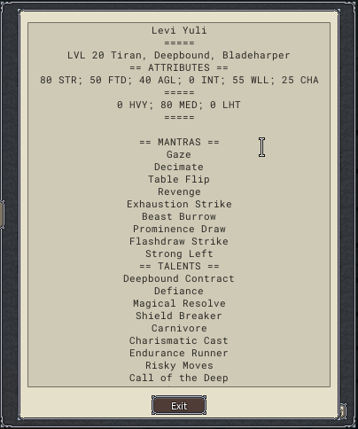
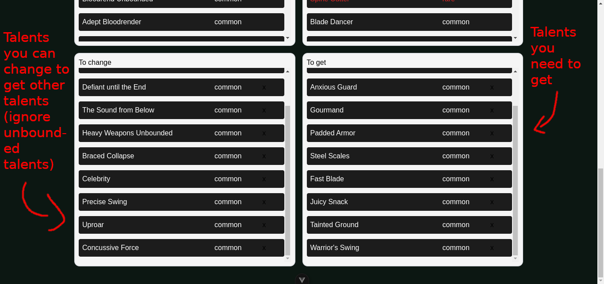

    <h2>dwapi-wrapper</h2>
    

# About
This is deepwoken build min-maxer using Cyfer's deepwoken api.

# Usage
Press tab and export build  
  
Copy all of them  
  
Past text you have just copied here  
  
Past your builder link here 
  
Press submit buttom  
  
Your talents from your build and character is shown in the first row  
  
Your talents you can change and get is shown in the second row  
  
  

Enjoy your sastified changing your talents process after beating ethiron(or fight 100 ferrymen or mooneyes stone idk), if you have any problem, contact me via Discord: [zimlewis](http://discordapp.com/users/733486464947454034)  

# Update-log
*1.0.5*:  
 - Build link title wrong since I was using a templates  

*1.0.4*:  
 - Fixed quest, oath, equipment and origin talents being considered as common talent in build's talents and character's talents.  
 - Added responsive for, hopefully supported mobile device. <bt />
 - changed remove talent button.  

*1.0.3*:
 - Relize I did not build for production, hopefully fixed.  

*1.0.2*:
 - Turn out it has error because I use import .. from '@/..', changed to relative part, hopefully fixed.  

*1.0.1*:
 - Fixed import main.css.  

*1.0.0*:
 - Hopefully being functional.  

# To-do
 - Hopefully gui to look more like deepwoken, not guarantee, I'm a mere backend developer who learnt Vue as a subject in school and decided to make this instead of doing my assignment.  

